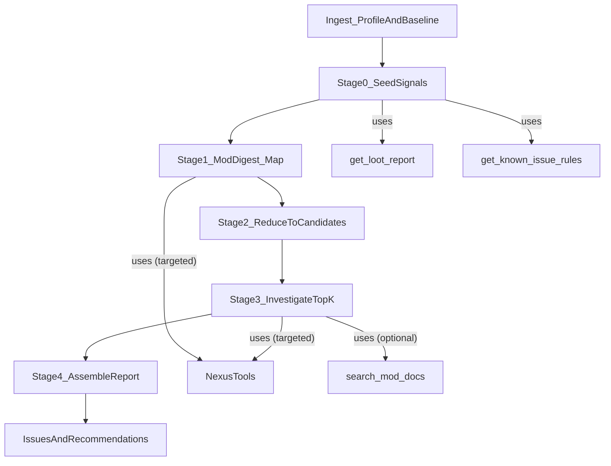

## Goal

Make the agent **flexible by construction**: it should discover and investigate novel issues, not just fill predefined buckets, by shifting from a monolithic prompt to an explicit **multi-stage orchestrator** with dynamic issue generation, targeted tool calls, and bounded context.

## Current blockers (in code today)

- The agent still serializes the full `ProfileSnapshot` into a prompt (`JSON.stringify(profile)`) in [`src/main/agent/skyrimAgentGraph.ts`](src/main/agent/skyrimAgentGraph.ts).
- Output is validated against a **fixed category enum** (`issueCategorySchema`), and `Issue.category` is a **union type** in [`src/shared/types.ts`](src/shared/types.ts). This structurally prevents novel categories.
- Reasoning is largely a **single pass** (ReAct agent → natural-language summary → “format to JSON”), which encourages rigid, template-like results.

## Architecture change

### Replace ReAct core with explicit staged orchestrator

Create a new orchestrator module and migrate `runSkyrimAgent` to call it.

### Stage definitions

- **Stage0: Seed signals**
  - Input: `ProfileSnapshot`, `offlineIssues`, `offlineRecommendations`.
  - Output: `SignalIndex` (cheap, mostly deterministic):
    - plugin→mods map
    - baseline issue refs
    - “interesting mods” shortlist (high importance/stale/framework_like/overhaul_like/has DLL etc.)
    - (optional) LOOT report snapshot if needed

- **Stage1: Mod digest map**
  - Produce a **richer `PerModDigestV2`** than the current minimal digest.
  - Sources: existing mod fields (`requirementsAgent`, `variantAgent`, `scriptPerfRiskAgent`, `overlapTagsAgent`, Nexus category/topic hints) plus **targeted Nexus tool calls** for high-impact/uncertain mods.
  - Must be **cacheable** (on-disk) and **bounded** (hard caps on evidence strings and summary length).

- **Stage2: Reduce to IssueCandidates**
  - Deterministic clustering + lightweight model pass:
    - build clusters from `systemsAffected` / overlap facets
    - compatibility graph from `requirementsAgent` and description-derived edges
  - Emit many `IssueCandidate` objects (dynamic), each with:
    - hypothesis, affected mods/plugins, evidence pointers, investigation plan

- **Stage3: Investigate top-K**
  - Select top K by severity×confidence×novelty.
  - Perform targeted tool calls only for those candidates:
    - `get_nexus_mod_files`, `get_nexus_mod_file_contents_summary`, comment/collection tools when relevant
  - Refine into final `Issue` + `Recommendation` with citations/evidence.

- **Stage4: Assemble + dedupe + normalize**
  - Merge with offline baseline (keep baseline issues, add novel ones).
  - Dedupe/merge similar issues.
  - Optional: normalize categories for UI display while keeping raw category strings.

### Run budgets, failure modes, and stop conditions (make flexibility safe)

- **Hard caps per run** (fail fast + log when exceeded):
  - max digests computed (Stage1)
  - max candidates generated (Stage2)
  - max investigated candidates (Stage3)
  - max tool calls (overall + per-tool)
  - max model calls (overall + per-stage)
- **Partial-results policy**:
  - If Nexus tools fail/are rate-limited: continue using cached digests + existing metadata, downgrade confidence, and attach the error context to the issue trace (not as hallucinated facts).
  - If Stage3 fails mid-run: return whatever candidates were already refined; do not return an empty report unless everything failed.
  - If parsing/validation fails for any single issue: drop that issue and keep the rest, logging the reason (avoid “all-or-nothing” failure).

## Data model changes (enables flexible issues)

### 1) Make categories open-ended

- Change `Issue.category` from `IssueCategory` union to **`string`** in [`src/shared/types.ts`](src/shared/types.ts).
- Keep a small set of canonical category strings used by rules/LOOT (backwards compatible), but allow arbitrary new ones from the agent.

#### Optional normalization layer (UI convenience)

- Add optional `categoryNormalized?: string` (or compute client-side) so the UI can group consistently while preserving the raw `category`.

### 2) Add facets + evidence structure (minimal but extensible)

- Add optional fields to `Issue`:
  - `facets?: Array<{ kind: string; value: string; confidence: "high"|"medium"|"low"; evidence: string[] }>`
  - `supportLinks?: Array<{ kind: string; url: string; label?: string }>`
  - continue using `IssueEvidence` for Nexus IDs/URLs/comment IDs.

#### Evidence reference strategy (avoid bloated Issue.details)

- Prefer structured evidence refs (internal or output) rather than pasting large text blobs into `details`:
  - Example: `evidenceRefs?: Array<{ source: string; modId?: string; url?: string; snippet: string }>`
- Keep `Issue.details` readable: include short quotes/snippets and point to links/IDs in evidence fields.

### 3) Introduce internal types (main-process only)

- `PerModDigestV2` (cached): systemsAffected, mechanismHints, deprecation/replacement signals, support links, requirements edges, evidence snippets.
- `IssueCandidate` (internal): hypothesis + evidence refs + investigation plan.
- `ClusterBrief` / `SignalIndex` for Stage2 reduction inputs.

## Tooling integration (use what’s already present)

- Leverage existing Nexus investigative tools exposed in [`src/main/agent/tools/langchainTools.ts`](src/main/agent/tools/langchainTools.ts).
- Use them **only** in Stage1 (for uncertain/high-impact mods) and Stage3 (for top-K investigations).
- Keep strong prompt budgets by passing **cluster briefs and digest summaries**, not raw profile/mod JSON.

## Logging/tracing (to make iteration possible)

- Add run-scoped context: `runId`, `profileId`, `modelId`, complexity/opinionatedness.
- Emit stage span logs:
  - Stage1: cache hits/misses, digests computed, Nexus calls
  - Stage2: clusters built, candidates generated
  - Stage3: candidates investigated, tool calls, final issues
- Include “why” fields: scoring breakdown for top-K selection and evidence IDs used.

### Trace artifacts (debuggable iterative agent)

- Add `analysisTraceId` (or similar) to `AnalysisResult.metadata`.
- Persist a per-run trace artifact (JSON) containing:
  - `IssueCandidate[]` (including scoring breakdown)
  - top-K selection inputs/outputs
  - tool call list (name, args redacted/summarized, durations, error flags)
  - final issues/recommendations mapping back to candidate IDs
- UI can optionally surface a lightweight “Debug” panel later; not required for v1, but the stored artifact enables deep debugging.

## Stage-specific implementation notes (more explicit)

### Stage1 digest contract

- `PerModDigestV2` must be:
  - **bounded**: cap evidence strings and total text length per mod
  - **cacheable**: keyed by (modPath + meta.ini version + modelId + digestSchemaVersion)
  - **composed**: deterministic signals first, then targeted LLM/tool enrichment only when needed

### Stage2 deterministic baseline (stability before LLM)

- Implement a fully deterministic baseline:
  - clusters from `systemsAffected`/facets (confidence≥medium)
  - compatibility graph edges from requirements/load order rules/deprecation signals
  - candidate generation rules that create IssueCandidates without any model call
- Optionally run a small LLM refinement pass on **cluster briefs** (not raw modlists) to propose additional candidate hypotheses or facet values.

### Stage3 investigation plan DSL (keeps tool usage controlled)

- `IssueCandidate.investigationPlan` should be explicit and bounded:
  - Example: `[{ tool: \"get_nexus_mod_files\", args: { nexusId: 123 } }, ...]`
- This prevents “agent decides to call everything” and supports strict budgets.

## UI implications

- Update renderer to treat `issue.category` as a display string, not an enum.
- If the UI groups by category, implement a lightweight normalization mapping (optional) so novel categories don’t break grouping.
- Expose issue facets/support links in IssueDetails view when present.
- **UI refactors are expected/acceptable**: if existing UI assumptions (enum categories, grouping, filters) get in the way, prioritize correctness and flexibility over preserving the current UI structure; we can restructure/rebuild UI components as needed.

### Suggested UI target shape (non-binding)

- Issues list groups by `categoryNormalized` with fallback “Other”.
- Issue details:
  - “Facets” chips (kind/value/confidence)
  - “Evidence” section (snippets + links + Nexus IDs)
  - “Support links” section when present
  - (Optional later) “Debug” section referencing the stored trace artifact

## Files likely to change

- Orchestrator and internal schemas:
  - Create [`src/main/agent/orchestrator.ts`](src/main/agent/orchestrator.ts) (or folder `src/main/agent/orchestrator/`).
  - Update [`src/main/agent/skyrimAgentGraph.ts`](src/main/agent/skyrimAgentGraph.ts) to delegate to orchestrator and remove ReAct/summary-to-JSON pipeline.
- Shared types:
  - Update [`src/shared/types.ts`](src/shared/types.ts) (`Issue.category: string`, add optional facets/supportLinks).
- Pipeline wiring:
  - Update [`src/main/analysis/pipeline.ts`](src/main/analysis/pipeline.ts) to call the new orchestrator entrypoint.
- UI:
  - Update [`src/renderer/components/IssueDetails.tsx`](src/renderer/components/IssueDetails.tsx) and [`src/renderer/components/IssuesList.tsx`](src/renderer/components/IssuesList.tsx) if they assume fixed categories.

## Acceptance criteria

- Agent no longer serializes the full modlist into one prompt.
- Agent emits **novel categories** (free-form strings) without schema rejection.
- Agent produces `IssueCandidate` traces and investigates top-K candidates with targeted tool calls.
- Overlap results are driven by facets/systemsAffected rather than naive scoring lists.
- Logs show per-stage counts, tool calls, and why top-K candidates were chosen.

## Testing & cost evaluation

- **Regression harness**:
  - Save a few representative profiles and expected “known findings” (lightweight golden checks).
  - Add tests/assertions that:
    - no stage constructs a prompt containing the full modlist
    - Stage2 produces candidates on non-trivial profiles
    - Stage3 investigates only top-K and respects budgets
- **Cost reporting**:
  - Record per-stage: model calls, tool calls, durations, and approximate token usage/response sizes.
  - Emit a concise end-of-run summary for tuning K and thresholds.

## Implementation todos

- **arch-orchestrator**: Implement explicit Stage0–Stage4 orchestrator and route analysis through it.
- **types-open-category**: Change `Issue.category` to string and update UI grouping/rendering accordingly.
- **digest-v2**: Implement `PerModDigestV2` (systemsAffected, facets, requirements edges, deprecation/support links) and caching boundaries.
- **candidates-reduce**: Build clustering + IssueCandidate generation with scoring/novelty.
- **investigate-topk**: Implement top-K investigation loop using Nexus tools and optional docs tool.
- **logging-spans**: Add stage-span logs + evidence references + scoring breakdowns.
- **trace-artifacts**: Persist per-run trace JSON and expose `analysisTraceId` in result metadata.
- **regression-harness**: Add basic regression tests for budgets, candidate generation, and investigation caps.
- **cost-reporting**: Emit per-stage cost/usage summary in logs and trace artifacts.