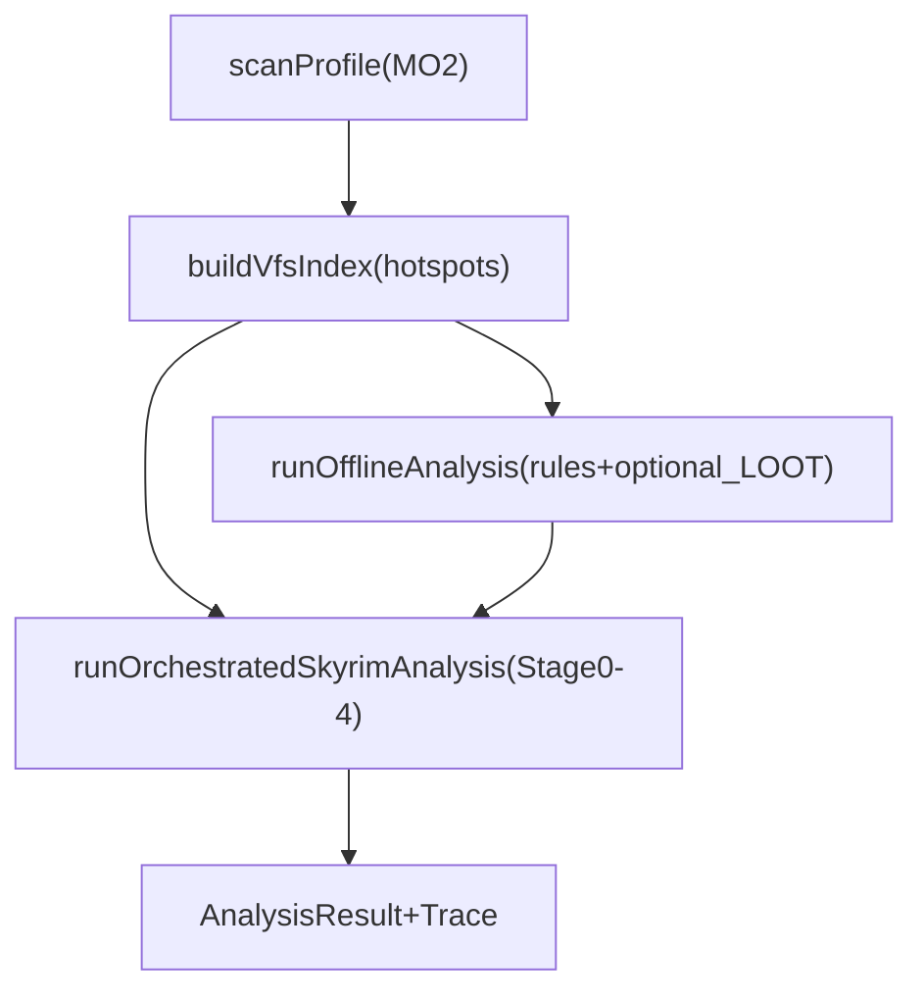

## Goal

Add a deterministic MO2 VFS/conflict layer (no MO2 plugin) so the orchestrator can reason from “what files actually win” and “who overwrites whom” in high-risk areas (scripts/interface/SKSE/etc.), with a fixture-based harness for repeatable testing.

## Constraints and decisions (from you)

- Track A only (no MO2 plugin required for users).
- Start **hotspots-first**, but allow expanding toward broader scans via configuration.
- Fixtures-first harness, with guidance for extracting fixtures from your real MO2 instance.
- Root Builder support: only pursue if needed for correctness (not for core Data-VFS conflict graph).
- Ensure we interpret MO2 left-pane priority ordering correctly (winners/edges depend on it).

## Architecture changes (high level)

- **New**: a `VfsIndex` computed from on-disk MO2 state (mods + overwrite + mod priority), producing:
  - final “winner” info for scanned virtual paths
  - conflict **edges** (A overrides B) with counts by category + sample paths
  - per-mod deterministic “file signatures” (scripts/interface/SKSE dll presence, etc.)

## Implementation plan

### Quick glossary (implementation-level)

- **Virtual path**: a path relative to the game `Data/` root (e.g. `scripts/foo.pex`, `interface/bar.swf`). This is the key used for winner/conflict computation.
- **Winner**: the mod (or overwrite) whose file is the final provider for a given virtual path based on left-pane order.
- **Edge (A→B)**: “A overwrites at least one virtual path previously provided by B.” Edges store weighted counts (by category) and a small bounded sample of paths.
- **Hotspot**: a virtual-path region that is high-risk or high-conflict density (scripts/interface/SKSE/…); scanned by default.

### 1) Implement VFS reconstruction + conflict graph (Track A)

- Create a new module to compute VFS-derived data.
  - Add: `src/main/mo2/vfsIndex.ts` (or `src/main/mo2/vfs/` folder) containing:
    - `buildVfsIndex({ instancePath, profileId, profile, settings, scope }): Promise<VfsIndex>`
    - an async directory walker that yields **relative virtual paths** without reading file contents
    - a `classifyVirtualPath(path): VfsCategory` function (taxonomy-driven)
- Inputs to VFS builder:
  - MO2 mod ordering and enablement already come from `modlist.txt` via `[src/main/mo2/mo2Scanner.ts](src/main/mo2/mo2Scanner.ts)`.
  - Use `profile.mods` and their `path` fields (`<instance>/mods/<modName>`).
  - Include `<instance>/overwrite` as final overlay (documented behavior in MO2 technical guide: `https://stepmodifications.org/wiki/Guide:Mod_Organizer/Advanced`).
- Output shape (main-process internal types; keep out of renderer/shared unless needed):
  - `VfsIndex`:
    - `categoriesScanned: VfsCategory[]`
    - `perModSignature: Record<modId, ModFileSignature>`
    - `edgeCounts: Record<winnerModId, Record<loserModId, ConflictEdgeCounts>>`
    - `edgeSamples: Record<winnerModId, Record<loserModId, string[]>>` (bounded sample paths)
    - `overwriteSummary: { nonEmpty: boolean; countsByCategory: Record<VfsCategory, number> }`
- Concrete internal type sketch (implementation guidance; adjust during coding):
  - `type VfsCategory = "scripts"|"interface"|"skse_dll"|"skse_config"|"plugins"|"ini"|"behavior"|"nemesis"|"dyndolod"|"synthesis"|"bsa"|"other_hotspot"`
  - `type VfsWinnerId = string | "__overwrite__" | "__base__"`
  - `type ConflictEdgeCounts = { total: number; byCategory: Partial<Record<VfsCategory, number>> }`
  - `type ModFileSignature = { counts: Partial<Record<VfsCategory, number>>; flags: { hasScripts:boolean; hasInterfaceSwf:boolean; hasSkseDll:boolean; hasBsa:boolean } }`
- Directory enumeration strategy (fast + Windows-safe):
  - Enumerate relative paths only (no file content reads).
  - Normalize virtual-path keys using:
    - forward slashes
    - `.toLowerCase()` for case-insensitive map keys on Windows.
  - Prefer `fs.readdir({ withFileTypes:true })` recursion with a small max depth per hotspot root.
  - Skip obviously irrelevant/huge trees by default (e.g. textures) unless scope expands.
  - Honor MO2 “Hide” semantics by ignoring any file path that ends with `.mohidden` (MO2 implements hide via `.mohidden` rename; see STEP docs/discussions). This prevents falsely counting hidden files as present/conflicting.
  - In `full` scope, also ignore obvious non-game/noise files by default (configurable), e.g. `meta.ini`, `*.log`, `*.txt`, `*.md`, unless the taxonomy explicitly includes them.
- Caching strategy (avoid rescans on repeated analyses):
  - Cache per-mod hotspot file lists + signatures under `.tmp-cache/vfs/` keyed by:
    - mod folder path
    - a cheap fingerprint (directory mtime + file counts, or a rolling hash over `(relativePath, size, mtimeMs)` for hotspot files)
  - Invalidate when fingerprint changes.
  - Fingerprints and cached lists should exclude `.mohidden` files so “hide/unhide” changes correctly affect results.
- How to compute efficiently (streaming edges, not full origin stacks):
  - Maintain `winnerByPath: Map<string, string>` only for paths that match the chosen taxonomy filters.
  - For each mod in priority order:
    - enumerate hotspot paths in its folder
    - for each virtual path:
      - if path unseen → set winner
      - else → increment edge `currentMod -> previousWinner` for that category; update winner
  - Enumerate `overwrite/` last and treat it as winner source (either a special pseudo-mod id like `__overwrite__` or map it to a synthetic mod entry).
- Verify mod priority direction (MUST-HAVE early test):
  - Add a minimal fixture with two enabled mods that both provide the same virtual path (e.g. `interface/test.swf`).
  - Assert the computed winner matches the expected MO2 left-pane ordering you encode in `modlist.txt`.
  - This prevents an “inverted winners graph” bug that would silently corrupt all downstream signals.
- Hotspots-first scope + expansion:
  - Add a `scope` parameter (settings override) to allow:
    - `hotspots` (default)
    - `extended` (more folders)
    - `full` (all loose files; warn about cost)
  - Also add runtime hotspot discovery:
    - Track collision rates per category while scanning.
    - If a category shows unexpectedly high collisions or file counts, log it and optionally expand within that category (still bounded by budgets).
- Runtime hotspot discovery (concrete heuristic):
  - During hotspots scan, compute `{ uniquePaths, collisions }` per category and the ratio `collisions/uniquePaths`.
  - If a category’s ratio exceeds a threshold (example: > 0.10) OR `uniquePaths` exceeds a threshold, mark it “dense”.
  - In `extended` scope, expand only dense categories first (still bounded by max files/time caps).
- Full loose-files scan guardrails:
  - Require explicit opt-in via settings (default off).
  - Add hard caps: `maxTotalFiles`, `maxFilesPerMod`, `maxMs`.
  - If caps are hit, stop scanning and continue analysis with partial VFS coverage (record partial coverage in trace/metadata).

### 2) Integrate VFS index into pipeline + orchestrator inputs

- Pipeline integration point:
  - Update `[src/main/analysis/pipeline.ts](src/main/analysis/pipeline.ts)` to compute `VfsIndex` once per run, after `scanProfile()` and any Nexus enrichment, before offline evaluation and before orchestrator.
  - Prefer: enrich a local `profileForAnalysis` (not `ProfileSnapshot` shared type) by attaching `VfsIndex` separately to the orchestrator input.
- Orchestrator input extension:
  - Extend `[src/main/agent/orchestrator/types.ts](src/main/agent/orchestrator/types.ts)` `OrchestratorInput` to include something like `vfs?: VfsIndex`.
  - Keep it optional so the agent still runs when scanning fails.
- Trace integration:
  - Add a bounded `vfsSummary` block to the orchestrator trace artifact (categories scanned, overwrite summary, top 20 edges by category, and a few sample paths).
  - Avoid dumping full winner maps into trace (too large); keep aggregates + samples.

### 3) Refactor early-stage signals to use deterministic file/conflict signals

- Stage0 improvements:
  - Update `[src/main/agent/orchestrator/stage0SeedSignals.ts](src/main/agent/orchestrator/stage0SeedSignals.ts)` scoring to include:
    - `hasSkseDll`, `hasInterfaceSwf`, `hasPapyrusPex`, `hasBsa`
    - “high conflict involvement” (incoming/outgoing edges in hotspots)
    - “overwrite impacts this mod” (if overwrite contains paths that would otherwise be won by the mod)
- Stage0 scoring implementation detail:
  - Add a helper `scoreVfsSignals(modId, vfsIndex)` returning `{ points, reasons[] }`, e.g.:
    - +6 `files:skse_dll`
    - +4 `files:interface`
    - +4 `files:scripts`
    - +X for high outgoing edge weight in `skse_dll/scripts/interface`
    - +Y for high incoming edge weight in those categories (surfaces “effectively overwritten” mods)
- Stage1 digest enrichment:
  - Update `[src/main/agent/orchestrator/stage1ModDigest.ts](src/main/agent/orchestrator/stage1ModDigest.ts)` so `PerModDigestV2` includes bounded deterministic evidence:
    - add facets like `files:scripts`, `files:interface`, `files:skse_dll` with evidence strings
    - add evidence snippets like `conflicts: overrides 7 interface files from SkyUI`
  - Add these fields to the digest cache key fingerprint so cache invalidates when signatures/conflicts change.
- Stage1 evidence strings (examples, bounded):
  - `files:scripts: present (pex=312)`
  - `files:interface: present (swf=9)`
  - `files:skse_dll: present (dll=2)`
  - `conflicts: outgoing interface overwrites=12; topVictim=SkyUI (6)`
  - `conflicts: incoming scripts overwrites=18; topOverwriter=__overwrite__ (14)`
- Stage2 candidate generation based on VFS edges:
  - Update `[src/main/agent/orchestrator/stage2ReduceToCandidates.ts](src/main/agent/orchestrator/stage2ReduceToCandidates.ts)` to add candidates:
    - `file_conflict_interface` (SWF conflicts)
    - `file_conflict_scripts` (PEX conflicts)
    - `file_conflict_skse` (DLL/config conflicts)
    - `overwrite_nonempty` and `generated_output_suspected`
  - Candidate evidenceRefs should include:
    - edge counts and a few sample virtual paths
    - mod ids/names involved
- Candidate prioritization (initial heuristic):
  - Prefer conflicts in this order (first pass):
    - `skse_dll` > `scripts` > `interface` > `behavior` > `ini` > `plugins` > other
  - Increase severity when:
    - overwrite folder participates
    - involved mod is `framework_like` or `overhaul_like`
    - the same pair conflicts in multiple categories
- Stage3 investigation policy:
  - Keep investigations bounded and targeted:
    - For file-conflict candidates, default to **no extra tool calls** unless Nexus/RAG is enabled and confidence is low.
    - If enabled, use docs search queries like `"<ModA> <ModB> patch"` or `"<ModA> compatibility <ModB>"`.
- Fix plugin→mod ownership heuristics (use the VFS scan, not name-prefix matching):
  - Today, `src/main/mo2/mo2Scanner.ts` attaches plugins to mods using `pluginName.startsWith(mod.name)` which is not reliable.
  - As part of the VFS work, compute a `pluginFileProviders` index by scanning enabled mod folders for `*.esm/*.esp/*.esl` (hotspot category `plugins`) and mapping `pluginNameLower -> modId[] (priority ordered)`.
  - Use this map to:
    - Improve Stage0’s `pluginToModIds` (and/or attach plugins to mods more accurately).
    - Later, connect LOOT messages and missing masters back to the correct mod(s).

### 4) Root Builder decision (minimal, conditional)

- For core Data-VFS conflict graph: **do not depend on Root Builder**.
- Add only a lightweight presence detector (optional, later in plan):
  - If `settings.skyrimSeDataPath` is provided, derive game root and check for known root-level components (SKSE loader, ENB/ReShade files) in the real filesystem.
  - Optionally detect Root Builder-style contributions by scanning enabled mods for `Data/root/` paths (Root Builder behavior described here: `https://www.nexusmods.com/skyrimspecialedition/articles/6614`).
  - Only use this to avoid false positives in “missing SKSE/ENB binaries” style issues.
- Practical decision rule:
  - Do not block Data-VFS conflict work on Root Builder.
  - Implement root detection only if/when the tool emits issues that depend on root-level components (SKSE/ENB/ReShade).

### 5) Test harness: fixtures-first + guidance to derive fixtures from your real setup

- Add a fixture directory convention (you create the content):
  - `test/fixtures/mo2/<caseName>/profiles/<ProfileName>/modlist.txt`
  - `test/fixtures/mo2/<caseName>/mods/<ModA>/...`
  - `test/fixtures/mo2/<caseName>/overwrite/...`
- Add Vitest tests that load fixtures and assert:
  - `WinnerIndex` chooses expected winners for a few known paths
  - conflict edges produce expected A→B counts
  - Stage2 emits expected candidate kinds
- Guidance: deriving fixtures from your real MO2 instance (minimal-copy workflow):
  - Pick a single “story” to test (one failure mode).
  - Identify 2–4 mods involved (from MO2 conflicts tab or your own knowledge).
  - Copy only the minimal file subtree needed into `test/fixtures/.../mods/<ModName>/...` (often 1–10 files).
  - Recreate `profiles/<ProfileName>/modlist.txt` with the same enabled state + order for those mods.
  - Add `overwrite/` content only when the case involves generated outputs.
  - Keep fixture names stable: `ui_swf_conflict`, `scripts_conflict`, `skse_dll_conflict`, `overwrite_nemesis`, `dyndolod_output`.
- Guidance for which real-world cases to convert into fixtures (copy only minimal files):
  - **UI SWF conflict**: SkyUI + HUD mod/preset overwriting `Data/interface/**/*.swf` (SWF issues are widely reported; e.g. `https://forums.nexusmods.com/topic/7263876-sky-ui-swf-errors/`).
  - **Papyrus script conflict**: two mods shipping same `Data/scripts/*.pex` (Papyrus performance/diagnostics context: `https://www.nexusmods.com/skyrim/articles/52764`).
  - **SKSE plugin presence/conflict**: `Data/SKSE/Plugins/*.dll` duplicated/overwritten.
  - **Overwrite hygiene**: fixture where `overwrite/` contains Nemesis output (Nemesis guides emphasize dedicated output mod; e.g. `https://www.nexusmods.com/skyrimspecialedition/articles/7021`).
  - **Generated LOD output**: fixture for DynDOLOD output rules (overwrite/load ordering guidance: `https://dyndolod.info/Help/Load-Overwrite-Orders`).

### 6) Layered taxonomy: research + expansion workflow (separate section you can iterate on)

- Start with a web-grounded “risk taxonomy” (hotspots):
  - `Data/scripts/*.pex` (Papyrus)
  - `Data/interface/**/*.swf` (UI)
  - `Data/SKSE/Plugins/*.dll` and configs (SKSE plugins)
  - `MO2/overwrite/`** (generated outputs override everything; MO2 technical guide explains overwrite layering: `https://stepmodifications.org/wiki/Guide:Mod_Organizer/Advanced`)
  - Nemesis output patterns and best practices (examples: `https://www.nexusmods.com/skyrimspecialedition/articles/7021`)
- Seed “generator/output” hotspot list (initial; expand from your setup):
  - Nemesis output (recommended output mod): `https://www.nexusmods.com/skyrimspecialedition/articles/7021`
  - DynDOLOD output / xLODGen output (overwrite/load ordering): `https://dyndolod.info/Help/Load-Overwrite-Orders`
  - Bashed Patch output and Synthesis output (common MO2 practice: dedicated output mods)
  - SKSE-generated logs/configs that end up in overwrite (common MO2 workflow; treat overwrite as a first-class signal)
- Then grow taxonomy using a repeatable “signals-first” method:
  - **Inventory pass**: for a handful of your real profiles, compute counts by top folder + extension (no content reads) and record the top 20 directories/extensions by frequency and by conflict rate.
  - **Promote to hotspot** when:
    - high conflict rate (many duplicate paths across mods)
    - high impact (known to break gameplay/UI/stability)
    - or known generator output (tools writing files)
  - **Add a facet** for each promoted hotspot: `files:<domain>` and optionally `generator:<tool>`.
  - Keep a small, versioned `taxonomy.ts` containing:
    - category definitions (path globs/extensions)
    - severity hints and recommended candidate kinds
- Make the initial taxonomy implementation-ready (v1 classifier rules; extend over time):
  - `scripts`: `^scripts/.*\\.pex$`
  - `interface`: `^interface/.*\\.swf$`
  - `skse_dll`: `^skse/plugins/.*\\.dll$`
  - `skse_config`: `^skse/.*\\.(ini|toml|json)$`
  - `plugins`: `^.*\\.(esm|esp|esl)$`
  - `ini` (low-priority, optional): `^.*\\.ini$`
  - `nemesis` (presence + overwrite hygiene): `^nemesis_engine/` (any)
  - `behavior` (start conservative; refine later): `^meshes/.*(behavior|behaviour)` (case-insensitive)
  - `bsa` (presence signal only): `^.*\\.bsa$`
  - Hidden files (MO2 hide feature): skip any path ending with `.mohidden` before category classification.
  - Expansion rule: promote new hotspots when the measured collision ratio is high AND the extension/top-folder is in an allowlist (prevents accidentally “discovering textures first”).

## Files to touch (initial set)

- VFS index builder: new `[src/main/mo2/vfsIndex.ts](src/main/mo2/vfsIndex.ts)`
- Pipeline wiring: `[src/main/analysis/pipeline.ts](src/main/analysis/pipeline.ts)`
- Orchestrator input/types: `[src/main/agent/orchestrator/types.ts](src/main/agent/orchestrator/types.ts)`
- Stage0 scoring: `[src/main/agent/orchestrator/stage0SeedSignals.ts](src/main/agent/orchestrator/stage0SeedSignals.ts)`
- Stage1 digests: `[src/main/agent/orchestrator/stage1ModDigest.ts](src/main/agent/orchestrator/stage1ModDigest.ts)`
- Stage2 candidates: `[src/main/agent/orchestrator/stage2ReduceToCandidates.ts](src/main/agent/orchestrator/stage2ReduceToCandidates.ts)`
- Tests: add new `test/vfsIndex.test.ts` + fixture-backed tests

## Acceptance criteria

- For a fixture case, Infinium can compute:
  - correct winner for known hotspot paths
  - correct A→B conflict edges with counts by category
- Stage0 “interesting mods” elevates mods with SKSE DLLs, interface SWFs, scripts, and high conflict involvement.
- Stage2 emits at least one conflict candidate derived from deterministic edges.
- Runs stay bounded (no full-tree scan unless configured) and caching reduces repeated scan cost.
- When scan caps are hit, analysis still completes and trace records partial coverage (e.g. scannedMods/scannedFiles/categoriesScanned and a `partial=true` marker).
- Hidden files renamed with `.mohidden` are excluded from winners/signatures/edges so MO2 “Hide” does not create false conflicts/signals.

